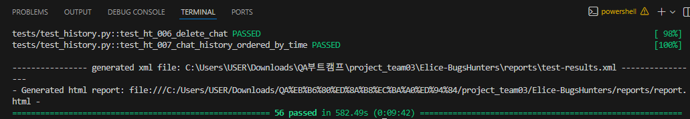

# Project 1 — UI Test Automation with Selenium

## 🔎 Project Overview

본 프로젝트는 웹 서비스의 주요 사용자 기능을 대상으로  
**Selenium 기반 UI 테스트 자동화 구조를 설계하고 구현한 프로젝트입니다.**

테스트 코드는 **Page Object Model(POM)** 구조를 적용하여  
UI 요소 접근 로직과 테스트 로직을 분리했으며  
동적 UI 환경에서도 안정적으로 동작하도록 설계했습니다.

부트캠프 초기 프로젝트로,  
UI 기반 자동화 테스트 구조를 이해하고 구현하는 것을 목표로 진행되었습니다.

본 리포지토리에는 **실제 프로젝트에서 제가 단독 또는 주도적으로 작성한 코드만 선별하여 포함**했습니다.

🔗 Original Repository  
https://github.com/minojj/Elice-BugsHunters.git


---

## 🎯 Project Goals

- Selenium 기반 UI 테스트 자동화 구현
- Page Object Model 기반 테스트 구조 설계
- 동적 UI 환경 대응 테스트 작성
- pytest 기반 테스트 실행 환경 구성


---

## 📊 Test Execution Result

- Total: 56
- Passed: 56 
- Failed: 0 
- Success Rate: 100 %
- Average Time: 9-10 m 

- 테스트 시나리오: Agent 생성 / 수정 / 삭제 / 관리
- 실행 환경: pytest + Selenium
- E2E 중심의 테스트 실행을 통해 주요 사용자 흐름이 정상 동작하는지 검증

<details>
<summary><strong> 📊 Test Result </strong></summary>


</details>


---


## 🧠 My Role

본 프로젝트에서 다음 영역을 담당했습니다.

- Page Object Model 기반 **공통 UI 테스트 구조 구현**
- Selenium interaction을 표준화하는 **BasePage 클래스 설계**
- pytest 기반 **테스트 실행 환경 구성 (`conftest.py`)**
- Agent 관리 도메인 Page Object 구현
- 공통 구조에 맞도록 일부 테스트 코드 구조 정리


---

# 🛠 Tech Stack

| 구분 | 기술 |
|-----|-----|
| Language | Python |
| Test Framework | pytest |
| UI Automation | Selenium WebDriver |
| Test Structure | Page Object Model |
| Collaboration | Jira |
| Browser Automation | ChromeDriver |

---

## 🧱 Test Strategy

본 프로젝트는 **Page Object Model(POM)** 구조를 기반으로 구성되었습니다.


### BasePage

모든 페이지 클래스에서 공통적으로 사용하는 기능을 제공하는 베이스 클래스입니다.

주요 기능

- Selenium WebDriverWait 기반 안정적인 element 접근
- 공통 element 탐색 메서드 제공
- 안정적인 클릭 동작 처리

```python
get_element()
get_elements()
click_safely()
```


이를 통해 **UI 요소 접근 방식을 표준화**하고  
테스트 코드의 **재사용성과 유지보수성**을 높였습니다.

---

### 🧩 Page Object

각 페이지의 UI 요소와 동작을 **Page 클래스**에서 관리합니다.

#### 예시
- Agent Explorer 페이지  
- My Agents 생성 페이지  
- My Agents 관리 페이지  

#### Page Object 클래스는 다음 책임을 가집니다.
- locator 정의  
- 페이지 동작 메서드 구현  
- UI 상태 검증 로직  

---

### 🧪 Tests

`tests` 폴더에서는 실제 테스트 시나리오를 작성합니다.  
각 테스트는 **Page Object**를 사용하여  
사용자 흐름 기반 동작을 검증합니다.

### 예시
- Agent 생성 기능 테스트  
- Agent 삭제 기능 테스트  
- Agent 관리 기능 테스트  

---

### ⚙ 테스트 환경 구성

`pytest` 기반 테스트 환경을 구성하기 위해  
`conftest.py`를 사용하여 **공통 테스트 설정**을 관리했습니다.

### 예시
- WebDriver 초기화  
- 테스트 환경 설정  
- 공통 fixture 제공  

이를 통해 테스트 코드에서 **반복되는 환경 설정을 제거**했습니다.

---

### 🔎 테스트 안정성 고려 사항

UI 자동화 테스트의 특성상, 동적 UI 동작으로 인해 테스트가 불안정해질 수 있습니다.  
이를 해결하기 위해 다음과 같은 방법을 적용했습니다.

### ✅ Explicit Wait 활용
- `WebDriverWait`, `ExpectedConditions` 적용  
- UI 렌더링 완료 이후 테스트 실행되도록 대기 로직 추가  

### ✅ Scroll 기반 요소 탐색
- 스크롤 기반 로딩 구조(UI 카드 목록 등)에서  
  모든 요소를 탐색하기 위한 `scroll` 로직 구현  

### ✅ JavaScript 기반 클릭 처리
- Selenium 기본 `click()`으로 동작하지 않는 경우  
  JavaScript `click()`을 활용하여 안정성 확보  

---

## 📋 Test Management

프로젝트 진행 과정에서 **Jira**를 활용하여 테스트 작업을 관리했습니다.

### 주요 관리 항목
- 테스트 케이스 관리  
- 버그 리포트 등록  
- 테스트 진행 상태 관리  

---

## 📈 Key Learnings

이 프로젝트를 통해 다음과 같은 경험을 얻었습니다.

- Selenium 기반 UI 테스트 자동화 구현 경험  
- Page Object Model 기반 테스트 구조 설계  
- UI 테스트 자동화에서 발생하는 동적 UI 문제 대응 경험 
- pytest 기반 테스트 실행 환경 구성  

---

## 💡 Reflection

본 프로젝트에서는 **Selenium 기반 UI 자동화를 구조화**하면서  
Page Object Model 기반 테스트 구조를 설계했습니다.  
이를 통해 테스트 코드의 재사용성과 유지보수성을 개선했습니다.

그러나 일부 테스트는 **UI 상태나 실행 순서에 의존**하는 구조로 인해  
테스트 독립성이 충분히 확보되지 않는 문제도 있었습니다.  

이 경험을 통해 이후 프로젝트에서는 다음의 중요성을 인식하게 되었습니다.  
- 테스트 독립성 확보  
- API 기반 테스트 활용  
- 테스트 환경 관리  

이러한 경험은 이후 진행한  
**API 및 성능 테스트 자동화 프로젝트 (Project 2)** 설계에 큰 영향을 주었습니다.

