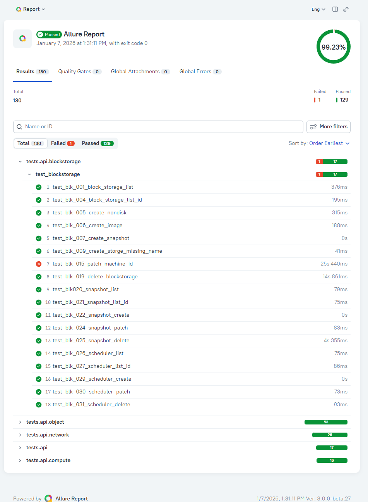

# Project 2 – API & Performance-Centered Test Automation with E2E

## 🔎 Project Overview

**ECI라는 클라우드 인프라 관리 서비스**를 인증, 환경, 성능을 고려해 **테스트 자동화 체계를 설계**하고 
CI 환경에서 **실행 → 검증 → 리포팅까지 연결**하는 것을 목표로 한 팀프로젝트입니다.

> 단순 기능 검증을 넘어 **공용 클라우드 환경에서도 리소스 의존성과 인증 제약을 고려해 반복 가능하고 안정적인 테스트 실행 구조**를 설계했습니다.
> > 해당 리포지토리에는 개인이 직접 설계하거나 구현에 주도적으로 참여한 코드만 포함되어 있습니다.

- 테스트 레이어: API / Performance / E2E
- 주요 초점:
  - 인증·환경·리소스 의존성을 고려한 테스트 구조
  - 공용 테스트 환경에서의 안정적인 성능 테스트 설계

## 🧰 Tech Stack

| Category | Tools |
|---|---|
| Test Framework | pytest, pytest-xdist |
| API Testing | Python, requests |
| E2E Testing | Selenium |
| Performance Testing | JMeter |
| CI/CD | Jenkins |
| Reporting | Allure |

## ✨ Highlights

- 158개 API 테스트 케이스 중 130개 자동화 (82.3%)
- Jenkins + Allure 기반 CI 실행/리포팅 파이프라인 구축
- 공용 클라우드 환경 제약을 고려해 Load–Spike–Recovery–Soak 성능 오케스트레이션 설계
- 사용자 흐름에 맞춘 E2E 테스트로 추가 검증

## 📌 My Contribution (Code-Level)

- API 테스트
  - 담당 도메인 테스트 코드 작성
    - Network : 26 tests
      - Network용 conftest.py / helpers.py   
    - PFS : 2 tests
  - 로그인 로직 코드 및 공통 실행 환경 코드 작성 : requirements.txt / .gitignore / common_conftest.py / [config.py](src/common/auth/config.py) / .env.sample / api_client.py / [token_manager.py](src/common/auth/token_manager.py) 
- 성능 테스트 파이프라인
  - 담당 도메인 테스트용 jmx 파일 작성
    - Network : 8
  - 전체 구조 설계 및 구현 : analyze_result.py / analyze_soak_result.py / analyze_spike_result.py / run_all_on_local.sh / run_jmeter.sh / cleanup_entry.py / cleanup_function.py
- CI 파이프라인: Jenkins 기반 실행 구조 설계(Jenkinsfile)

## 📊 Project Results (Summary)

- **API Tests**
  - Total: 158
  - Automated: 130 (82.3%)
  - Parallel Execution:
    - Local: pytest-xdist (6 workers)
    - CI: Jenkins stage-level parallel pipeline
  - Avg Runtime:
    - Local execution: ~3 min
    - CI execution: ~8 min
> 팀 프로젝트 과정에서 테스트케이스 기준 자동화 목표와 최종 브랜치 기준 실행 범위 사이에 차이가 있음을 확인했습니다. 그래서 포트폴리오에는 실제 저장소와 Allure 결과로 검증 가능한 최종 수치만 반영했습니다.
  
- **Performance Tests**
  - Stable: 800 users / ramp-up 30s / loop 10
  - Upper Bound: 1100 / 40 / 30
  - Stress: 1300 / 40 / 30
> 단순 부하 실행이 아니라 공용 클라우드 환경에서 안정 운영 가능 구간과 한계 구간을 정량적으로 식별했습니다. 
> SLA 기준은 반복 성능 테스트를 통해 측정한 baseline을 기반으로 정의했습니다.
> > Stable: Avg / P95 / Error Rate 충족 
> > Upper Bound: 일부 SLA 초과 
> > Stress: 오류율 증가로 운영 불가 

- **E2E Tests**
  - Core VM & Resource Lifecycle Covered

→ API 기능 검증을 자동화하여 반복 테스트 비용을 줄이고 CI 환경에서 안정적인 회귀 테스트 기반을 구축했습니다.

<strong> 📊 API Test Execution Result (Allure Report)</strong>

아래 이미지는 **로컬 환경에서 실행한 API 테스트의 Allure 리포트 예시**입니다.  
프로젝트에서는 Jenkins 기반 CI 파이프라인과 Allure 연동 구조를 설계했으며, 해당 리포지토리에는 재현 가능한 실행 증거로 최종 자동화 코드 기준으로 실행한 로컬 테스트 결과를 첨부했습니다.

- Total: 130  
- Passed: 129  
- Failed: 1  
- Success Rate: 99.23%

> Failed 처리된 하나는 flaky test로 판단하여 재현성 확보가 어려운 상태였으며 외부 환경 요인에 의한 테스트 불안정 사례로 분류했습니다.

## 🧠 My Role & Key Contributions

- API / Performance 테스트의 **공통 테스트 자동화 구조 설계**를 담당
- pytest 기반 테스트 실행 구조 및 CI 파이프라인 설계
- E2E 테스트를 포함한 **실행 환경 구성** 주도적 담당
- **Network 및 Parallel File System 도메인 테스트 구현**을 담당

> E2E 테스트는 API 테스트의 신뢰성 확보를 우선 전략으로 두고,  
> 사용자 흐름 검증을 위한 **보조 수단으로 부분 적용**했습니다.

다음은 해당 프로젝트에서 제가 **직접 설계하거나 주도적으로 구현한 영역**입니다.

1️⃣ OAuth 인증 구조 개선을 통한 API 테스트 안정성 확보

**기여 내용**
- OAuth 인증 흐름을 분석하여 토큰 발급 로직을 분리
- 발급된 토큰을 .env에 저장하고 pytest fixture로 공통 사용
- 토큰 만료 시 재발급 가능하도록 구조 설계

**결과**
- API 테스트 간 인증 의존성 제거
- 테스트 재사용성과 실행 안정성 확보

2️⃣ 테스트 코드와 실행 환경을 분리하기 위한 환경 변수 표준화

  
**기여 내용**
- .env + config.py를 통해 계정 정보, ZONE_ID, JMeter 실행 경로 등을 코드와 분리 
- 로컬 / CI 환경에서 동일한 테스트 코드 재사용 가능하도록 구성 

**결과**
- 환경 변경 시 코드 수정 최소화 
- CI 연계 용이성 향상 

  

3️⃣ JMeter 기반 성능 테스트 자동화 파이프라인 구축

**기여 내용**
- JMeter .jmx 실행을 위한 run_jmeter.sh 작성
- 결과 .jtl 파일을 검증하는 Python 스크립트 구현
- 두가지를 한번에 자동실행할 수 있는 run_all_on_local.sh 작성
- Jenkins에서 성능 테스트 자동 실행 가능하도록 구성
- GET 요청은 Load/Spike 중심으로, 상태 변경 요청은 Soak 중심으로 분리해 API 특성에 맞는 성능 검증 기준을 설계
- JMeter 요청 명명 규칙을 표준화하여 요청 유형별 결과 집계와 TPS 검증의 일관성을 확보

**결과**
- 성능 테스트 실행 및 결과 검증 자동화
- 반복 실행 가능성 확보
  

4️⃣ 부하 실험을 통한 성능 한계·안정 구간 도출

**기여 내용**  
- thread / ramp-up / loop count를 조절하며 부하 실험 수행
- 최대 부하 구간, 성능 한계 지점, 안정 구간 도출

**결과**
- 단순 실행이 아닌 실험 기반 성능 분석 수행
- 성능 기준 판단 근거 확보

5️⃣ Jenkins + Allure를 활용한 CI 기반 테스트 결과 리포팅

**기여 내용**  
- pytest + Allure 연동
- Jenkins 실행 결과를 시각화된 리포트로 제공

**결과**
- 테스트 결과를 팀 단위로 공유 가능한 산출물로 제공

6️⃣ 프로젝트 산출물 및 결과 보고서 작성

**기여 내용**
- 프로젝트 전체 흐름과 테스트 전략을 설명하는 main README.md 작성
- 팀 단위 테스트 결과 보고서 작성에 참여
  - 테스트 환경 및 실행 구조 정리
  - 성능 테스트 결과 분석 및 부하 기준 도출
  - 실패 테스트 케이스 원인 분석 및 품질 리스크 정리
  - 자동화를 통해 발견된 주요 결함 요약
  - 향후 테스트 및 기술적 개선 방향 제안
  중심으로 담당

**결과**
- 테스트 범위, 실행 결과, 품질 판단 근거를 외부에서도 이해 가능한 형태로 정리
- 단순 실행 결과 나열이 아닌, **분석·판단 중심의 QA 결과 보고서**로 프로젝트 성과를 문서화
- 향후 회귀 테스트 및 품질 개선 논의에 활용 가능한 기준 자료로 활용 가능

 
## 🖥️ Test Strategy Highlights

### 📐 Resource Dependency & Fixture-based Test Design

본 프로젝트의 테스트 대상 리소스(Network, Storage, Compute)는 **계층적 의존 관계를 가지며, 공용 테스트 환경 특성상 지속적 유지가 불가능**했습니다.
→ 각 테스트가 반드시 다음 원칙을 따르도록 설계했습니다.

이를 통해 테스트 간 간섭을 방지하고 반복 실행 가능한 **상태 격리(State-isolated) 테스트 환경**을 구축했습니다.

- 전체 테스트 흐름에서 리소스 의존성 문제를 해결하기 위해
  - 모든 테스트는 생성 → 검증 → 정리(Cleanup)를 자체적으로 책임지도록 설계

- **API Tests**:
  - Stateless API 중심으로 병렬 실행
  - Resource dependency는 fixture lifecycle 구조 표준화로 관리

- **Performance Tests**:
  - GET: Load / Spike
  - POST: Soak only (stateful & resource-intensive)
  - Resource dependency는 setup과 teardown 단계를 거치고, clean up으로 safety net 구축
  - Load–Spike–Load 순서로 실행하여 공용 클라우드 환경에서의 **일시적 부하 이후 자동 회복 능력**을 검증

- **E2E Tests**:
  - User flow 신뢰성 확보를 위해 순차 실행
  - Resource dependency는 단계별로 생성-삭제를 반복하며 관리 

### 🔧 Parallel Execution Strategy (Design Decision)

| Test Type | Local | CI | Rationale |
|---|---|---|---|
| API Tests | ✅ Parallel | ✅ Parallel | 빠른 피드백 및 CI 실행 시간 단축 |
| Performance Tests | ✅ Scripted | ❌ (조건부) | 환경 제약 및 리소스 보호 |
| E2E Tests | ❌ Serial | ❌ Serial | 사용자 흐름 신뢰성 우선 |

> 📌 API 테스트는 **로컬에서는 pytest-xdist 기반 병렬 실행**,  
> CI 환경에서는 **Jenkins stage-level 병렬 실행** 구조로 설계했습니다.  
> 이를 통해 개발 과정에서 **빠른 피드백 확보와 CI 실행 시간 단축**을 목표로 했습니다.

<strong> ⚙️ Parallel Execution Observations </strong>

프로젝트 진행 중 API 테스트는  
로컬 환경에서는 **pytest-xdist 기반 테스트 병렬 실행**,  
CI 환경에서는 **Jenkins stage-level 병렬 실행 구조**로 운영되었습니다.

병렬 실행을 통해 개발 과정에서 **피드백 속도를 개선**할 수 있었지만,  
전체 실행 시간 단축 효과는 초기 기대보다 **제한적으로 나타났습니다.**

분석 결과 다음과 같은 특징을 확인했습니다.

- 일부 API 테스트가 다른 테스트보다 **상대적으로 긴 실행 시간을 가짐**
- 이러한 테스트가 **전체 pipeline 실행 시간을 결정하는 병목 역할**을 수행
- 그 결과 테스트 간 **실행 시간 편차(execution time variance)** 로 인해 병렬 실행의 효과가 **부분적으로 제한되는 현상**이 나타남

이 경험을 통해 다음과 같은 점을 확인할 수 있었습니다.

> 병렬 실행만으로 전체 실행 시간이 비례하여 단축되는 것은 아님  
> 테스트 분포와 병목 테스트의 존재가 **전체 실행 시간에 큰 영향을 미침**
> 또한 향후 테스트 수가 증가하고 실행 시간 분포가 보다 균등해질 경우 병렬 실행의 효과는 더욱 크게 나타날 수 있을 것으로 판단.

## 📎 Evidence & Reports

- 🔗 [ECI_Test_Result_Report_Summary](docs/reports/ECI_Test_Result_Report_Summary.md)
  → 자동화 범위, 성능 판단, 실패 분석 요약  
  
- 🔗 [Metrics & Visual Evidence](docs/reports/metrics.md)
  → 테스트 결과, 성능 지표, 실행 증거를 **포트폴리오 관점에서 요약**

- 🔗 [legacy project main README](docs/reports/legacy_project_main_readme.md)
  → 실제 프로젝트 진행 당시 사용된 **원본 팀 문서**

 

## 📁 Code Ownership & Implementation

본 리포지토리에는 실제 프로젝트에서 제가 **직접 설계하거나 구현에 주도적으로 참여한 코드만 선별하여 포함했습니다.**

- pytest 기반 API 테스트 코드: Network / Parallel File System 도메인 테스트용 코드, fixture / cleanup / polling 유틸
- 성능 테스트 자동화:
  - JMeter 실행 스크립트
  - 결과 검증 Python 로직
  - Load–Spike–Load 실행 오케스트레이션 스크립트
- pytest fixture 기반 리소스 lifecycle 관리
- Jenkinsfile을 통한 CI 파이프라인 구성 및 테스트 실행 단계 설계
- 프로젝트 결과 보고용 문서

👉 상세 설계 의도는 아래 문서에서 확인할 수 있습니다.
- 🔗 [로컬 성능 테스트 오케스트레이션 설계](docs/design/run_all_on_local_sh_design.md)

## 🎯 Troubleshooting & Key Design Decisions

이 프로젝트에서 발생한 주요 기술적 문제와 테스트 안정성 확보를 위해 내린 설계 결정들을 정리했습니다.

### ⭐ 대표 트러블슈팅 (Core Design Decisions)

<strong>1️⃣ OAuth 기반 인증 구조에서 API 토큰 전략 전환 이슈</strong>

**문제**  
API 테스트 중 Selenium 기반 재로그인이 간헐적으로 발생하고, 병렬 실행이 불가능한 구조였음.

**해결방법**  
OAuth 기반 UI 로그인 구조를 분석하여 API 단독 토큰 자동화의 한계를 인정하고,  
UI 1회 토큰 발급 + API 테스트 완전 분리 전략으로 전환.

**결과**  
- UI/API 테스트 책임 분리  
- 병렬 실행 가능  
- 테스트 안정성 향상

🔗[OAuth 기반 인증 구조에서 API 토큰 자동화 전략 전환 이슈](docs/troubleshooting/oauth_ui_token_strategy_tradeoff.md)

<strong> 2️⃣ pytest fixture 생명주기 및 리소스 정리 안정화 이슈</strong>

**문제**  
리소스 간 의존성이 강한 환경에서 fixture 기반 생성/삭제를 사용하던 중, 테스트 실패 시 리소스가 잔존하여 이후 테스트를 지속적으로 오염시키는 문제가 발생함.
특히 `session scope fixture` 사용으로 삭제 책임이 불명확해짐.

**해결방법**  
- fixture는 리소스 생성 책임만 담당하도록 축소
- 삭제는 별도의 `safe_delete + polling` 유틸 함수로 분리
- 삭제 요청 이후 실제 삭제 완료를 보장하도록 구조 재설계.
- 모든 실제 리소스 fixture를 `function scope`로 전환.

**결과**  
- 테스트 성공/실패 여부와 무관하게 리소스 정리 보장
- 비동기 삭제로 인한 연쇄 실패 제거
- 테스트 신뢰성과 반복 실행 안정성 향상
- fixture scope를 단순 실행 범위가 아니라 리소스 책임 경계(resource responsibility boundary)로 설계

🔗[API 테스트에서 fixture의 생명주기와 삭제 보장 이슈](docs/troubleshooting/pytest_fixture_lifecycle_and_cleanup.md)

<strong> 3️⃣ Jenkins CI 환경에서 Python 테스트 파이프라인 안정화 이슈</strong>

**문제**  
Jenkins CI 환경에서 `pytest + Allure` 자동화 파이프라인을 구성하던 중 `cleanWs()`와 네트워크 제한으로 인해 가상환경 및 패키지 설치가 간헐적으로 실패하며 
빌드 결과가 환경 상태에 따라 달라지는 문제가 발생함.

**해결방법**  
- 매 빌드 초기화를 포기
- VM에 사전 구성된 Python 가상환경을 재사용하는 전략으로 전환
- Jenkins는 테스트 실행과 리포트 생성만 담당하도록 역할을 단순화

**결과**  
- CI 환경에서 테스트 실행 안정성 확보
- 네트워크/권한 제약 환경에서도 빌드 실패 제거
- 발표·시연 환경에서도 일관된 결과 보장
- “이상적인 CI”보다 “현실적인 CI” 설계 경험 축적
  
🔗[CI 환경 구성 및 Jenkins 안정화 이슈](docs/troubleshooting/CI_environment_and_Jenkinsfile.md)

<strong> 4️⃣ 성능 테스트에서 teardown vs cleanup 전략 결정 이슈</strong>

**문제**  
성능 테스트(JMeter) 실행 중 실패가 발생할 경우, tearDown Thread Group이 실행되지 않아 테스트 리소스가 잔존하고
다음 테스트 실행에 영향을 주는 문제가 발생함.

**해결방법**  
- tearDown은 best-effort로 유지
- CI 환경에서는 Jenkinsfile에서 명시적인 cleanup 로직을 별도로 실행하도록 설계
- 로컬 실행(run_all_on_local.sh)에는 safety net으로 cleanup 단계를 추가

**결과**  
- 성능 테스트 실패 시에도 리소스 정리 보장
- CI 환경에서 테스트 결과와 무관한 안정성 확보
- 반복 성능 테스트 시 환경 오염 제거
- teardown과 cleanup의 역할을 명확히 분리한 설계 확립
  
🔗[성능 테스트에서 teardown vs cleanup 전략 결정 이슈](docs/troubleshooting/performance_test_teardown_vs_cleanup_tradeoff.md)

### 📌 추가 트러블슈팅 (Implementation / Edge Cases)

<strong> 5️⃣ 로컬 / CI 실행 환경 차이로 인한 성능 테스트 자동화 스크립트 실행 이슈 </strong>

  
🔗[로컬 / CI 실행 환경 차이로 인한 성능 테스트 자동화 스크립트 실행 이슈](docs/troubleshooting/local_ci_execution_entrypoint_issue.md)

<strong> 6️⃣ 성능 테스트 설계 오류로 인한 부하 한계치 오판 이슈 </strong>

  
🔗[성능 테스트 설계 오류로 인한 부하 한계치 오판 이슈](docs/troubleshooting/performance_load_design.md)

<strong> 7️⃣ MUI Autocomplete 및 Select 자동화 이슈 </strong>

  
🔗[MUI Autocomplete 및 Select 자동화 이슈](docs/troubleshooting/mui_autocomplete_select.md)

