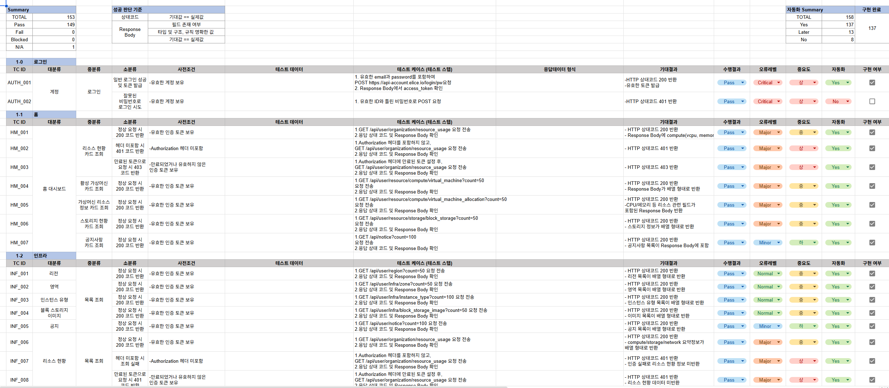

## ▪️ECI API 테스트 소개

> **ECI 사이트 API 테스트는 서비스에서 제공하는 주요 API 엔드포인트가 정상적으로 동작하는지를 확인하기 위해 수행되었습니다.**
> 
> 
> **각 API 요청과 응답을 기준으로 기능 동작 여부를 검증하며, ECI 사이트의 핵심 기능이 API 단에서 안정적으로 제공되는지를 확인하는 것을 목적으로 진행하였습니다.**
> 


<br>

## ▪️API 테스트 결과 요약

| **항목** | **결과** |
| --- | --- |
| **총 테스트 케이스** | **158개** |
| **자동화 성공 케이스** | **137개** |
| **실행 환경** | **병렬 6개 스레드** |
| **총 테스트 소요 시간** | **약 3분** |
| **Jenkins 성공률 평균** | **약 80%** |

<details>
<summary><strong>Allure 결과 리포트 미리보기</strong></summary>


</details>

<br>

## ▪️ API 명세서

아래 표는 ECI의 주요 엔드포인트의 핵심 요청/응답 필드를 요약한 내용입니다. 

전체 스키마는 [🔗전체 API명세서 보기](https://docs.google.com/spreadsheets/d/1e8LNYk1bJ4Kj9FAFixmPWQUegHEZanXB-SdNI_wVGUc/edit?pli=1&gid=0#gid=0)에서 확인 가능합니다.

| Method | Endpoint | 요청 데이터 | 응답 데이터 | 상태코드 |
| --- | --- | --- | --- | --- |
| GET | /organization/resource_usage | - | vm_count, storage_gb, gpu, cpu, memory | 200 |
| POST | /compute/virtual-machine/new | name, zone_id, instance_type_id | id (UUID) | 200 |
| PATCH | /network/network-interface/{ID}/edit | name (UUID) | id (UUID) | 200 |
| DELETE | /block-storage/block-storage | - | id(UUID),status | 200 |

- **전체 API 명세서 미리보기**


<br><br>

## ▪️ 테스트 케이스 설계

### 설계 기준

테스트 케이스는 기능 단위로 엔드포인트를 나누어 설계하였으며, 정상 흐름과 예외 케이스 모두 포함하도록 작성했습니다.
가능한 한 많은 시나리오를 포함하여 API 커버리지를 최대화하려고 노력했습니다. 
이를 통해 API의 안정성과 신뢰성을 높이는 데 중점을 두었습니다.


### 대표 테스트 케이스 미리보기

아래 사진은 API 테스트를 위한 **대표 테스트 케이스**입니다.

스크린샷으로 확인하거나, 🔗[전체 API TC  보기](https://docs.google.com/spreadsheets/d/1e8LNYk1bJ4Kj9FAFixmPWQUegHEZanXB-SdNI_wVGUc/edit?pli=1&gid=1900619120#gid=1900619120)에서 자세히 확인할 수 있습니다.




<br><br>

## ▪️ API 테스트 관련 디렉토리 구조

프로젝트의 API 테스트는 `src/utils`의 유틸리티 모듈과 `tests/api` 하위 기능별 테스트로 구성되며, `env`를 통해 테스트 환경을 유연하게 설정할 수 있습니다.
```
    project-root/
    ├─ src/
    │  └─ utils/
    │     ├─ api_client.py       # API 요청 처리 모듈
    │     ├─ endpoints.py        # API 엔드포인트 정의
    │     └─ token_manager.py    # 인증 토큰 관리
    ├─ tests/
    │  └─ api/                       # 자동화 테스트
    │     ├─ blockstorage/
    │     ├─ network/
    │     ├─ compute/
    │     ├─ object/
    │     ├─ test_home.py
    │     ├─ test_infra.py
    │     └─ test_parallelfilesystem.py
    ├─ env/                       # 환경 변수 설정 파일
```
<br>

## ▪️ 테스트 실행 방법 (로컬)

 테스트를 로컬 환경에서 실행하려면 다음 단계를 따르세요.

1. .env 파일 세팅
    
    `.env.sample` 파일을 참고하여 `.env` 파일을 생성하고 환경 변수 값을 설정합니다.
    
2. 테스트 실행 (Master Branch)

```jsx
    # project_root 이동
    cd project_root

    # 1. 토큰 받아오기
    python -m scripts.get_token

    # 2. 6개의 프로세스로 병렬 실행 (자신의 cpu 스펙의 맞게 갯수를 설정)
    python -m pytest tests/api --local-parallel --workers 6 
```


<br>

## ▪️ API 테스트 핵심 성과 & 강점

- PR 시점에서 자동화 테스트가 실행되어 **빠른 피드백** 제공
- 기능별로 체계적으로 작성된 테스트 케이스로 **주요 엔드포인트 대부분을 커버**
- 테스트 실패 시 어떤 요청에서 실패 했는지와 발생한 오류를 **쉽게 확인 가능**
- 재사용 가능한 유틸리티 모듈(`api_client`, `endpoints`, `token_manager`) 활용으로 **유지보수성과 확장성 향상**
- 총 120개 테스트 중 100% 성공, 병렬 6개 스레드 기준 **약 3분 내외**로 전체 테스트 완료

<br>

