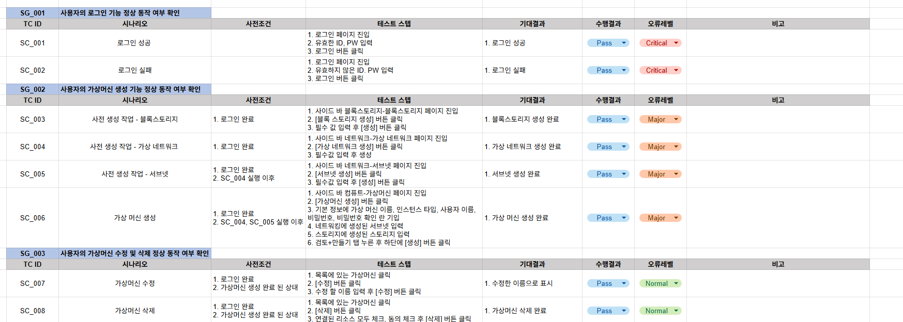

# ▪️E2E TEST
 이 프로젝트는 Selenium과 pytest를 사용하여 ECI 서비스의 주요 자원(Compute, Network, Storage) 등 생성부터 수정, 삭제까지의 전체 라이프사이클을 검증하는 E2E(End-to-End) 테스트 자동화 프로젝트입니다.

# ▪️주요 테스트 시나리오
* 사용자의 로그인 기능 정상 동작 여부 확인
* 사용자의 가상머신 생성 기능 정상 동작 여부 확인
* 사용자의 가상머신 수정 및 삭제 정상 동작 여부 확인
* 가상 클러스터 CRUD 정상 동작 여부 확인
* 공인 IP CRUD 정상 동작 여부 확인
* 블록스토리지 CRUD 정상 동작 여부 확인
* 스냅샷 CRUD 정상 동작 여부 확인
* 스냅샷 스케줄러 CRUD 정상 동작 여부 확인
* 버킷 CRUD 정상 동작 여부 확인

# ▪️테스트 케이스
[🔗전체 E2E 테스트케이스 보러가기](https://docs.google.com/spreadsheets/d/1e8LNYk1bJ4Kj9FAFixmPWQUegHEZanXB-SdNI_wVGUc/edit?gid=848435595#gid=848435595)



# ▪️E2E 테스트 관련 디렉토리 구조

```
    project-root/
    ├─ src/
    │  ├─ utils/                     # 공통 유틸리티 함수 및 헬퍼 모듈
    │  │   └─ locator.py       
    │  └── pages/                    # Page Object 클래스 (UI 요소 및 메서드 정의)
    │      ├── base_page.py
    │      ├── login_page.py
    │      ├── network_page.py
    │      └── object_page.py
    ├─ tests/
    │  └─ e2e/                       # 핵심 시나리오 UI 테스트
    │     ├─ test_scenario_create.py
    │     └─ test_scenario_resources.py
    └─ env/                          # 환경 변수 설정 파일 
```

# ▪️결과 리포트
|**항목**|**결과**|
|:--- |:--- |
|총 테스트 케이스 | 17개 |
|자동화 성공 케이스 | 17개 |
|실행 환경 | headless mode|
|테스트 완료 시간 | 3분11초|

서버 불안정으로 인해 실패 케이스가 2개 있음
 * [🔗Allure 결과 리포트 Jenkins에서 보기](http://127.0.0.1:5500/project_root/reports/allure-report/index.html)
