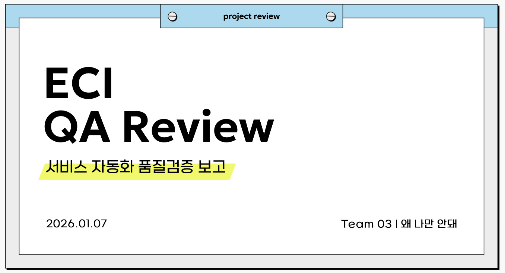

# ECI Test Automation Project_team03

**Automated test project for ECI services using pytest, Jenkins, and JMeter.**

> 왜 나만 안 되는 걸까? 그 의문에는 언제나 정답이 있습니다.
> 
> 
> 저희는 정답을 찾아내서 어디에서든 동작하게 만드는 사람들입니다.
> 

<br>

## 🔎Project Overview

- 대상 서비스: **Elice Cloud Infrastructure(ECI)**
- 목적: 클라우드 서비스의 동작을 확인하기 위한 API 기능 테스트, 성능 테스트, 사용자흐름을 고려한 E2E 테스트
- 프로젝트 주요 특징 :
    - **Page Object Model(POM)** 기반 구조
    - **명시적 대기**를 활용한 안정적인 테스트
    - **CI 환경(Jenkins)을 이용한 자동화**를 통해 주기적인 기능 및 성능 점검
    - 로컬/CI환경에서의 **API 및 Performance 테스트 병렬 실행 전략**을 통한 테스트 소모 시간 단축
    - **부하-스파이크-부하 테스트의 구조**로 클라우드 환경의 자동적인 복구 안정성 평가
    - 주요 기능을 기준으로 한 **사용자 중심 E2E 테스트 시나리오 구성**
    - 자원 상태 및 사용량 확인 API를 포함한 **서비스 가시성(Visibility) 기능 검증**

<br>

## 💥프로젝트 결과 요약

### ▪️API Test

| **항목** | **결과** |
| --- | --- |
| **총 테스트 케이스** | **158개** |
| **자동화 성공 케이스** | **137개** |
| **실행 환경** | **병렬 6개 스레드** |
| **테스트 총 소요 시간** | **약 3분** |
| **Jenkins 성공률 평균** | **약 80%** |

### ▪️E2E Test

| **항목** | **결과** |
| --- | --- |
| **자동화 성공 시나리오** | **17개** |
| **Critical Flow Coverage** | **VM & Resource 라이프사이클 전체 커버** |
| **테스트 총 소요 시간** | **약 3분** |

### ▪️E2E TEST 시연 영상
<a href="https://youtu.be/xh1jdQX8N60">
  
</a>

### ▪️ Performance Test

성능 테스트를 통해 ECI 서비스의 **최대 부하, 성능, 안정 구간을 도출**했습니다.

| **항목** | **Threads / Ramp-up / Loop Count** |
| --- | --- |
| 최대 부하 (Stress) | 1300 / 40 / 30 |
| 최대 처리 성능 (Upper Bound) | 1100 / 40 / 30 |
| 서비스 안정 구간 (Stable Range) | 800 / 30 / 10 |

<br>


<table align="center">
  <tr>
    <td align="center">
      
      <br>
      <sub>자동화 결함 감소 추이</sub>
    </td>
    <td align="center">
      
      <br>
      <sub>테스트 커버리지 확장(%)</sub>
    </td>
  </tr>
  <tr>
    <td align="center">
      
      <br>
      <sub>Flaky Test 비율(%)</sub>
    </td>
    <td align="center">
      
      <br>
      <sub>실행 시간 개선</sub>
    </td>
  </tr>
</table>


## 📐Test Scope

테스트는 API, UI, Performance 레이어로 분리하여 설계되었습니다. 각 테스트는 독립적으로 실행 가능하도록 구성되었습니다.

하위 리스트에서 각 테스트 상세 README를 확인 하실 수 있습니다.

[🔗API Tests](project_root/tests/api/README.md)

[🔗Performance Tests](project_root/performance/README.md)

[🔗E2E Tests](project_root/tests/e2e/README.md)

<br>

## ▶️How to Run

<details>
<summary>1️⃣ .env 파일 생성</summary>

아래 .env.sample에 따라 project_root 아래에 .env 파일을 생성해주세요.

[.env.samlpe](project_root/.env.sample)
</details>

<details>
<summary>2️⃣ venv 가상환경 실행</summary>

테스트의 일관성을 위해 venv 가상환경을 실행해주세요.  

```
.\.venv\Scripts\Activate.ps1
```
</details>

<details>
<summary>3️⃣ 필요 패키지 설치</summary>

requirements.txt 를 통해 필요 패키지를 설치해주세요.

```
pip install -r requirements.txt
```
</details>

<details>
<summary>4️⃣ API 토큰 발급</summary>

API 접속을 위한 토큰을 발급해주세요. (토큰 유효기간: 30분)
  
  ```
  python -m scripts.get_token
  ```
</details>


<details>
<summary>5️⃣ .env 파일 및 sh파일 확인</summary>

원활한 테스트 진행을 위해 .env파일과 sh파일의 줄바꿈형식을 **LF**로 변경 후 저장해주세요.
</details>


<details>
<summary>6️⃣ API 기능테스트 실행</summary>

로컬에서만 병렬 설정을 켜서 6개의 worker를 지정할 수 있도록 해당 명령어를 사용해주세요.

```
python -m pytest tests/api --local-parallel --workers 6
```
</details>

<details>
<summary>7️⃣ 성능 테스트 실행</summary>

성능 측정 후, 기준에 부합하는지 검증도 할 수 있도록 로컬에서는 해당 파일을 이용해주세요.

```
bash performance/scripts/run_all_on_local.sh
```
</details>

<details>
<summary>8️⃣ E2E 테스트 실행</summary>

E2E는 사용자흐름에 맞춰 진행하되, 병렬 실행에서 제외한 대신 headless모드로 진행해주세요.
현재 headless 모드가 기본으로 설정되어 있습니다.

```
python -m pytest tests/e2e
```
</details>

<details>
<summary>9️⃣ Jenkins 실행</summary>

직접 Jenkins UI에서 빌드 상황을 볼 수 있습니다. 계정 정보는 따로 연락부탁드립니다.

[GO Jenkins](http://61.107.202.228:8080/)
</details>

<br>

## 📊Test Coverage

### ▪️ API Domain

**Account & Access API**: Authentication & Token

**Platform API**: Home & Infra

**Resource API**: Compute (VM), Network, Block Storage, Object Storage, Parallel File System

### ▪️ Performance

API 특성에 따라 성능 테스트 유형을 구분하여 설계하였습니다.

**GET API는 Load/Spike** 테스트를, **POST API는 안정성 검증을 위한 Soak** 테스트를 중심으로 수행하였으며, POST API의 Load/Spike 테스트는 비현실적인 트래픽을 고려해 제외하였습니다.

| Test Type | API | Rationale |
| --- | --- | --- |
| Load Test | GET | 조회 중심 API의 트래픽 증가 대응 능력 검증 |
| Spike Test | GET | 순간적인 부하 변화 처리 능력 검증 |
| Soak Test | POST | 상태 변경 API의 장시간 안정성 검증 |
| (Excluded) Load / Spike | POST | 비현실적 트래픽 및 과도한 리소스 소모 방지 |

### ▪️ E2E

실제 사용자 흐름과 리소스 생명주기를 검증하는 특성상, 테스트 안정성과 결과 신뢰도를 우선하여 **E2E 테스트는 순차 실행으로 설계**하였습니다.

| Scenario | Scope | Execution |
| --- | --- | --- |
| VM creation user flow | End-to-End | Sequential |
| Resource lifecycle | Create → Update → Delete | Sequential |

<br>

## 📈 Test Pass Criteria

테스트 결과를 정량적으로 평가하기 위해 테스트 유형별 성공 기준을 정의하였습니다.

| Test Type | Pass Criteria |
| --- | --- |
| API Tests | HTTP status code 및 response schema 검증 통과 |
| E2E Tests | 주요 사용자 흐름이 오류 없이 수행되고 기대 결과가 정상 반영 |
| Performance Tests | 테스트로 도출한 서비스 안정 구간에서 Error Rate, Response Time, TPS 기준 적용 (Soak Test는 표준편차 포함) |

<br>

## 🛠 Tech Stack


<br>

## 📄Test Results & Reporting

- CI(Jenkins) 환경에서 테스트 실행 결과는 **Allure Report**를 통해 확인할 수 있습니다.
- Allure 리포트를 통해 테스트 성공/실패 여부, 실패 사유 및 실행 히스토리를 시각적으로 제공합니다.
- Jenkins 빌드 실행 후 Allure 리포트를 통해 각 테스트 단계별 결과를 확인할 수 있습니다.
- 상세 실행 로그는 Jenkins Console Output 및 Allure 리포트를 통해 확인합니다.

<br>

## ⚠️ Known Limitations & Assumptions

- 테스트 코드는 크로스 플랫폼 실행을 고려하여 작성되었습니다.
- 하지만 팀 내 macOS 환경이 부재하여 macOS에서의 실제 실행 검증은 수행하지 못했습니다.
- 해당 환경에 대한 실행 가능성은 추가 검증이 필요합니다.

<br>

## 💥 트러블슈팅

- **E2E 테스트 중 리소스 상태 업데이트 지연 및 세션 유지 문제**
    - **문제**: UI상에서 상태 변화가 즉시 감지되지 않아 테스트 검증 단계에서 실패가 발생
    - **해결방법**: 브라우저 새로고침 대체 및 자동 재시도 로직 도입
    - **결과**:  테스트 100% 성공
        
        [🔗 멀티쓰레드 자원 경합 및 Race Condition 해결 ](https://kdt-gitlab.elice.io/qa_track/class_02/qa-project2/team_3/team03_eci/-/wikis/troubleshooting---performance)
        

- **성능테스트 중 공유 변수 덮어쓰기로 인한 자원 삭제 실패 개선**
    - **문제**: 자원을 생성하고 ID를 추출했으나, 전역 공간에 저장할 때 고유한 식별자 없이 저장하여 이전 쓰레드의 ID를 덮어쓰는 현상 발생
    - **해결방법**:  각 쓰레드의 고유 번호를 키값에 결합하여 논리적으로 분리된 저장 공간을 구현
    - **결과**:  생성된 자원을 루프를 돌며 정확히 삭제함으로써 서버 내 좀비 리소스 발생을 차단함
        
        [🔗 리소스 상태 업데이트 지연 및 세션 유지 문제 ](https://kdt-gitlab.elice.io/qa_track/class_02/qa-project2/team_3/team03_eci/-/wikis/troubleshooting-e2e)
        

- **MUI Autocomplete 및 Select 자동화 이슈**
    - **문제**: 키보드 입력이 일어나지 않거나, 옵션 선택이 실패하거나, 폼 validation 작동이 일어나지 않아 생성 버튼 비활성화 유지됨
    - **해결방법**:  각 형식별로 드롭다운 옵션 선택 및 값 입력 방식을 바꾼 뒤, 헤더 선택으로 blur 이벤트 발생으로 트리거 해결
    - **결과**:  각각 선택한값이 'value'에 정상 반영되고, 'aria-expanded' 속성이 false로 변경되며 버튼 활성화 성공
        
        [🔗 MUI Autocomplete ](https://kdt-gitlab.elice.io/qa_track/class_02/qa-project2/team_3/team03_eci/-/wikis/MUI-Autocomplete/MUI-Autocomplete-%EB%B0%8F-Select-%EC%9E%90%EB%8F%99%ED%99%94-%EC%9D%B4%EC%8A%88)
        

- **공용 테스트 환경에서의 성능 테스트 리소스 관리 설계**
    - **문제**: 공용 ECI 서비스의 리소스 생성 제한으로 단일 Setup 기반 성능 테스트가 불안정함
    - **해결방법**:  Setup을 2단계로 분리하고 JSR223 + props 전역변수로 리소스를 공유해 GET 중심 성능 테스트 구조로 재설계
    - **결과**:  서비스 제약을 준수하면서 안정적인 성능 테스트 수행 및 테스트 종료 후 리소스 누적 없이 정리 가능
        
        [🔗 성능 테스트 리소스 관리 설계](https://kdt-gitlab.elice.io/qa_track/class_02/qa-project2/team_3/team03_eci/-/wikis/%EA%B3%B5%EC%9A%A9-%ED%85%8C%EC%8A%A4%ED%8A%B8-%ED%99%98%EA%B2%BD%EC%97%90%EC%84%9C%EC%9D%98-%EC%84%B1%EB%8A%A5-%ED%85%8C%EC%8A%A4%ED%8A%B8-%EB%A6%AC%EC%86%8C%EC%8A%A4-%EA%B4%80%EB%A6%AC-%EC%84%A4%EA%B3%84)
        

- **병렬 테스트 실행 시 과도한 실행 시간 및 실패 발생**
    - **문제**:  병렬 테스트 실행 시 23분 소요, 9개 테스트 실패(403), Grant 테스트 teardown 97초 과다
    - **해결방법**:  Polling 횟수 조정, 병렬 부하 고려한 활성화 대기 시간 증가, Timestamp 밀리초 단위 변경, 재시도 간격 단축
    - **결과**:  병렬 실행 시간 80% 단축, 테스트 실패율 개선, Teardown 시간 44% 단축
      
        [🔗 병렬 테스트 최적화](https://kdt-gitlab.elice.io/qa_track/class_02/qa-project2/team_3/team03_eci/-/wikis/%EB%B3%91%EB%A0%AC-%ED%85%8C%EC%8A%A4%ED%8A%B8-%EC%B5%9C%EC%A0%81%ED%99%94-%ED%8A%B8%EB%9F%AC%EB%B8%94%EC%8A%88%ED%8C%85-%EB%B3%B4%EA%B3%A0%EC%84%9C)
