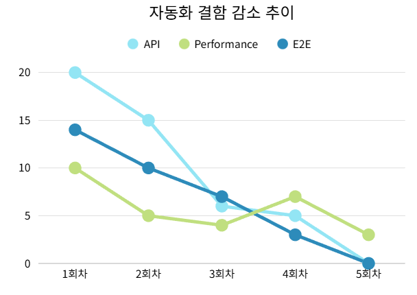
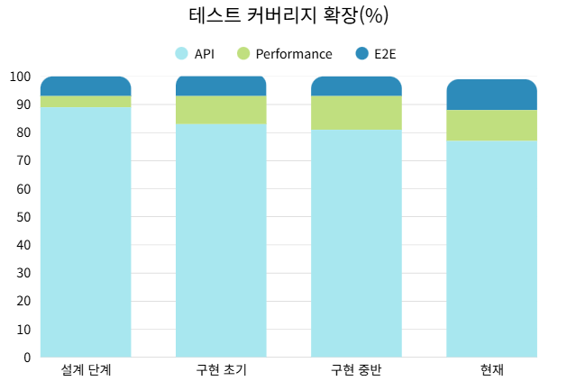
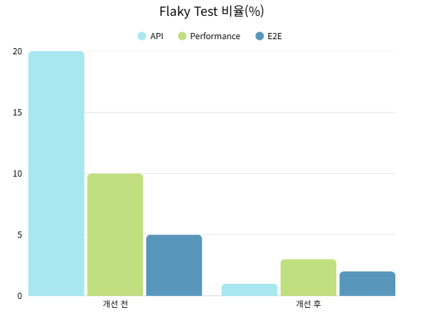
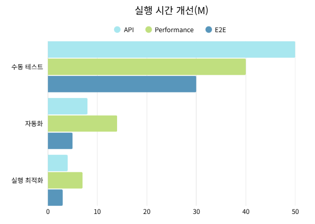

# 📊 Test Metrics & Evidence  
**ECI Test Automation Project – Results Summary**

본 문서는 **ECI Test Automation Project**에서 수행한  
**API / Performance / E2E 테스트의 정량적 결과와 실행 증거**를  
포트폴리오 관점에서 요약한 문서입니다.

> ※ 실제 프로젝트 진행 당시 사용된 원본 문서는  
> `legacy_project_main_readme.md` 를 참고하세요.

---

## 1️⃣ Project at a Glance

| 항목 | 내용 |
|---|---|
| 대상 서비스 | Elice Cloud Infrastructure (ECI) |
| 테스트 유형 | API / Performance / E2E |
| 실행 환경 | Local + Jenkins CI |
| 주요 목적 | 인증·환경·성능을 포함한 테스트 자동화 체계 검증 |

---

## 2️⃣ Test Coverage Summary

<table align="center">
  <tr>
    <td align="center">
      
       
      자동화 결함 감소 추이
    </td>
    <td align="center">
      
       
      테스트 커버리지 확장(%)
    </td>
  </tr>
  <tr>
    <td align="center">
      
       
      Flaky Test 비율(%)
    </td>
    <td align="center">
      
       
      실행 시간 개선
    </td>
  </tr>
</table>

### ▪ API Test Coverage

| 항목 | 수치 |
|---|---|
| 전체 테스트 케이스 | 158 |
| 자동화 케이스 | 137 |
| 자동화 비율 | **86.7%** |
| 병렬 실행 | 6 workers |
| 평균 실행 시간 | 약 3분 |

#### 도메인별 커버리지 요약

| Domain | Automation Rate |
|---|---|
| Home / Infra | 100% |
| Compute | 95.7% |
| Network | 83.9% |
| Block Storage | 58.1% |
| Object Storage | 98.1% |
| Parallel File System | 100% |

---

### ▪ E2E Test Coverage

| 항목 | 수치 |
|---|---|
| 전체 시나리오 | 22 |
| 자동화 시나리오 | 22 |
| 실행 방식 | Sequential |
| 커버 범위 | VM & Resource Lifecycle |

> 📌 API 테스트의 신뢰성 확보를 우선 전략으로 두고,  
> E2E 테스트는 **핵심 사용자 흐름 검증을 위한 보조 수단**으로 적용

---

## 3️⃣ Performance Test Results

### ▪ Load Profile & Stability Range

| 구간 | Threads / Ramp-up / Loop | 판단 |
|---|---|---|
| Stable | 800 / 30 / 10 | ✅ 안정 운영 가능 |
| Upper Bound | 1100 / 40 / 30 | ⚠️ 한계 상한 |
| Stress | 1300 / 40 / 30 | ❌ 운영 불가 |

### ▪ Key Metrics (Stable Range)

- **Avg Response Time**: ~80 ms  
- **P95 Response Time**: ~200 ms  
- **Error Rate**: 0.00%

> 📌 CI 기반 회귀 성능 테스트 기준 구간으로 **Stable Range 채택**

---

## 4️⃣ Execution Evidence

### ▪ Jenkins CI Execution

- API / Performance / E2E 테스트 자동 실행
- Jenkins Pipeline 기반 단계별 실행
- 병렬 테스트 전략 적용

### ▪ Test Reporting

- **Allure Report**를 통한 결과 시각화
- 테스트 성공/실패 이력 추적 가능
- Jenkins Console Log + Allure 연계 분석

---

## 5️⃣ Defects Discovered via Automation

| Bug ID | 영역 | 요약 | Severity |
|---|---|---|---|
| #3 | Activity Log | 타 계정 로그 노출 | High |
| #4 | Login | 메인 화면 진입 실패 | High |
| #7 | Resource | 타 계정 리소스 수정/삭제 가능 | High |

> 📌 자동화 테스트를 통해 UI·API 간 정보 불일치 및  
> 권한 문제를 조기에 발견

---

## 6️⃣ Performance Stability Analysis

- Load / Spike / Soak 단독 실행 시 기준 충족
- Spike 연속 적용 시 일시적 성능 저하 발생
- 부하 완화 후 **자동 회복 가능성 확인**

➡️ **ECI 서비스는 급격한 부하 상황에서도 회복 가능한 안정성을 보유**

---

## 7️⃣ Troubleshooting Highlights

- 병렬 실행 시 리소스 ID 충돌  
  → **Thread-safe key 설계로 해결**
- 공용 환경 리소스 제한  
  → **2단계 Setup 구조로 재설계**
- E2E UI 상태 반영 지연  
  → **Retry & Polling 전략 적용**

> 📎 상세 내용은 legacy 문서의 Troubleshooting 섹션 참고

---

## 8️⃣ Impact of Test Automation

| 항목 | 효과 |
|---|---|
| 회귀 테스트 | 테스트 시간 대폭 단축 |
| 신뢰성 | 재현 가능한 검증 구조 확보 |
| 성능 검증 | SLA 기반 정량 판단 가능 |
| 유지보수 | 테스트 코드 구조화 |
| 협업 | 실행 방식·환경 표준화 |

---

## 9️⃣ Conclusion

본 프로젝트에서는 **API / Performance / E2E 테스트 자동화 체계**를 구축하고,  
CI 환경에서 **실행 → 검증 → 리포팅**까지 연결함으로써  
실제 운영 환경에서도 신뢰 가능한 품질 검증 기반을 마련했습니다.

해당 결과는 향후 **회귀 테스트 및 성능 모니터링의 기준 자료**로  
활용 가능합니다.

---

## 🔗 Related Documents

- 📄 `legacy_project_main_readme.md`  
  → 실제 프로젝트 당시 사용된 원본 팀 문서  
- 📁 Domain별 상세 README  
  → API / Performance / E2E 세부 설계 및 실행 방식

